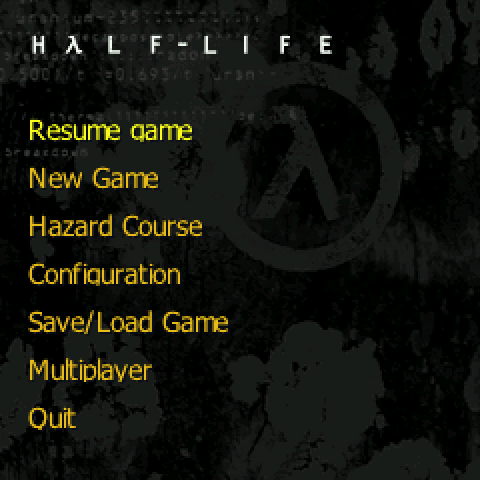
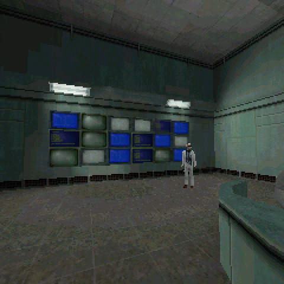
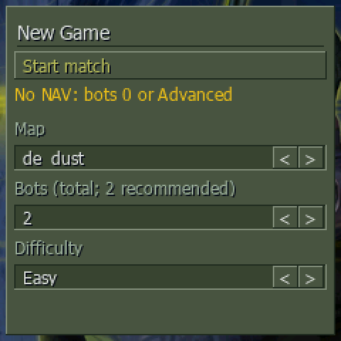
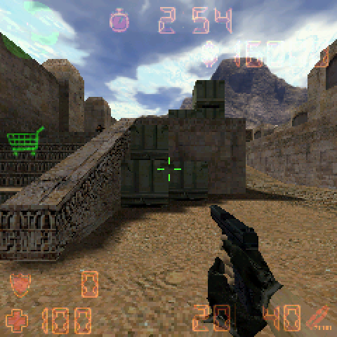

# Half-Life and Counter-Strike for RG Nano and FunKey S

Half-Life and Counter-Strike 1.6 running natively on the tiny 240×240 screen of the **Anbernic RG Nano** and the **FunKey S**, with menus, HUD and controls made for them.

<p>




</p>

**No game files are included.** You need your own copy of Half-Life (and Counter-Strike 1.6 if you want it), for example from Steam.

## Download

Get the latest zip from the [Releases page](https://github.com/DankMiimer/rg-nano-xash3d/releases/latest).

## What you need

- An **RG Nano** or a **FunKey S** running [DrUm78's FunKey OS](https://github.com/DrUm78/FunKey-OS/releases).
- **Half-Life** from Steam. Counter-Strike 1.6 is optional.
- About **900 MB** free on the SD card.

## Install

1. **Put the SD card in your PC.** Use a card reader, or connect the console over USB and choose *Mount USB* in its menu.
2. **Copy your game files.** In Steam, right-click Half-Life → *Manage* → *Browse local files* (usually `Steam\steamapps\common\Half-Life`). Copy the `valve` folder, and the `cstrike` folder if you have Counter-Strike, into `FunKey\Xash3D-source` on the SD card. Create that folder if it doesn't exist.
3. **Copy the release.** Unzip the download and copy everything inside its `SD card` folder to the root of the SD card. Choose *Replace* when asked.
4. **Play.** Put the card back, open **Native games** and start **Half-Life** or **Counter-Strike**.

The first start takes a few seconds longer: the game builds its menu artwork and launcher icon from your own game files. The new icon appears after the next restart.

When you're done the SD card looks like this:

```
SD card
├── FunKey
│   └── Xash3D-source
│       ├── valve       ← your Half-Life files + this release
│       ├── cstrike     ← your Counter-Strike files + this release
│       ├── engine
│       └── …
└── Native games
    ├── Half-Life.opk
    └── Counter-Strike.opk
```

## Controls

| Button | Action |
|---|---|
| D-pad | Walk and turn |
| Hold **R** + D-pad | Look up/down and strafe |
| Hold **L** | Faster camera |
| **X** / **Y** | Shoot / reload |
| **A** / **B** | Use / jump |
| Hold **Fn** | Crouch |
| **Start** | Half-Life: flashlight · Counter-Strike: buy menu |
| **Fn + Start** | Half-Life: next weapon · Counter-Strike: auto-buy |
| **Fn + L** / **Fn + R** | Half-Life: quick save / quick load |
| **Menu** | Game menu: save, load, options, quit |
| **Fn + A** / **Fn + Y** | Volume up / down |
| **Fn + X** / **Fn + B** | Brightness up / down |
| Hold **Fn + L + R** | Force quit if a game is stuck |

In Counter-Strike menus, **Fn + Left / Down / Right** pick 1 / 2 / 3 and **Fn + Start + L / R** pick 4 / 5.

Prefer aiming with the face buttons? Turn on **Face-button aiming** under *Nano settings → Control scheme* and restart the game. See [all controls](docs/CONTROLS.md).

## Good to know

- **Closing the lid saves.** Closing the FunKey S lid, or pressing the RG Nano power button, saves Half-Life and switches the console off. Turn it on again and you continue where you left off. Counter-Strike just closes.
- **Saves:** in Half-Life, *Menu → Save/Load Game* shows three saves at a time with pictures (**A** load, **X** save, **Y** delete).
- **Counter-Strike** starts with an offline match setup: choose the map, the number of bots (0–7) and the difficulty. Bots need a navigation file for each map, which a new install doesn't have yet. If you see *No NAV: bots 0 or Advanced*, either play with 0 bots, or open *Advanced*, tick *Allow slow NAV analysis* and start. The console then spends a few minutes (once per map) mapping it for the bots. Bots fight normally but don't use voice chatter.
- **Settings** for frame rate, aiming and HUD size are under *Nano settings* in each game's options.
- **Performance:** both games are capped at 30 FPS by default and held that in the tested scenes. Busy scenes can drop below it, and there are pauses while levels load: these consoles only have 64 MB of RAM.

## Updating

Repeat install step 3 with the new release. Your saves and settings are kept.

## Uninstalling

Delete `Native games\Half-Life.opk`, `Native games\Counter-Strike.opk` and the `FunKey\Xash3D-source` folder (this also deletes your saves).

## Troubleshooting

- **"Files missing" message:** check that the `valve` (and `cstrike`) folders are directly inside `FunKey\Xash3D-source`, not one folder deeper.
- **The game stops responding:** hold **Fn + L + R** for a few seconds.
- **Logs** are in `FunKey\Xash3D-source\diagnostics`. Please attach them when you [report a problem](https://github.com/DankMiimer/rg-nano-xash3d/issues).

---

## Technical details

Everything below is for people who want to know how it works or build it themselves.

### How it works

- The engine is [Xash3D FWGS](https://github.com/FWGS/xash3d-fwgs) with its software renderer, built from pinned source with the FunKey SDK. It draws straight to the Linux framebuffer, reads the buttons through evdev and streams sound through ALSA. No SDL and no external OPK are used.
- Half-Life uses [HLSDK Portable](https://github.com/FWGS/hlsdk-portable). Counter-Strike uses [CS16Client](https://github.com/Velaron/cs16-client) and [ReGameDLL_CS](https://github.com/s1lentq/ReGameDLL_CS) with bots.
- The launcher (`nano-run.sh`) raises the CPU to 1200 MHz while playing and restores 1008 MHz afterwards. It also loads the game's button map, sets up audio and supervises the game (Fn + L + R recovery, logs).
- Menus and the HUD are adapted for a square 240×240 screen; see [UI changes](docs/NANO-UI-V2.md) and [menu appearance](docs/NANO-UI-VISUAL.md). Memory work (texture sharing, demand-zero pools) is described in [MEMORY.md](docs/MEMORY.md).

### RG Nano and FunKey S

Both consoles have the same Allwinner V3s chip, 64 MB of RAM and 240×240 screen, and DrUm78's FunKey OS runs them on the same board definition, button daemon and audio setup. The port uses no kernel modules, and its CPU clock tool is the one [NanoCraft](https://github.com/DankMiimer/nanocraft) already uses on both consoles.

The one real difference is the FunKey S lid. On power-off, FunKey OS sends `SIGUSR1` to the running game and powers off 0.1 s later unless the game takes over. The launcher takes over, and the engine saves single-player progress to `nano_poweroff` and quits normally. The launcher then writes FunKey OS's standard *Instant Play* file and powers off. On the next boot FunKey OS starts the launcher again, which loads that save. This is the same mechanism FunKey OS emulators use. Details: [POWER-OFF.md](docs/POWER-OFF.md).

Release testing covered the RG Nano. A FunKey S has not been tested yet; reports are welcome.

### Release contents

The release zip contains the engine, the game libraries (built from the GPL and Valve SDK sources above), the launchers and a free Tahoma-compatible menu font from Wine. It contains **no Valve game data or artwork**:

- The menu backgrounds and logos, and the launcher icons, are built on the console at first launch from the player's own files by `nano-art` ([src/nano-art.c](src/nano-art.c)). It gives the same result as the PC script `tools/prepare_menu_art.py`.
- The optional Valve intro needs `tools/prepare_intro.py` and FFmpeg on a PC. See [menu appearance](docs/NANO-UI-VISUAL.md).
- Bot navigation files are generated on the console the first time a map is played with bots.
- Counter-Strike bots use our own [bot profiles](assets/cstrike/BotProfile.db). CS16Client's extra package also carries Condition Zero bot voices, training maps and menu files; the release leaves those out, so bots don't use voice chatter. The engine's own FWGS `extras.pk3` ships unchanged.

### Building from source

Use Linux or Ubuntu under WSL with Python 3.12+, Pillow, Git, CMake, Ninja, GCC, squashfs-tools and ADB, plus **FunKey SDK 2.3.0** from the [FunKey OS releases](https://github.com/FunKey-Project/FunKey-OS/releases). Upstream revisions are pinned in [sources.lock.json](sources.lock.json). Build outside your home folder: compiled-in source paths would otherwise include your user name, and the release packager refuses that.

```sh
export FUNKEY_SDK=/absolute/path/to/FunKey-sdk-2.3.0
export NANO_NATIVE_DIR=/var/tmp/rg-nano-native   # a Linux filesystem builds much faster under WSL
bash tools/build.sh                  # CS libraries and menu, renderer, Nano helper tools
bash tools/build-native.sh           # engine, filesystem, menu and Half-Life libraries
python3 tools/package_release.py --version v1.0.0   # → build/release/*.zip
```

For a private install that also includes your game data, the PC-prepared artwork and the Valve intro, use `tools/prepare_native.py` and `tools/install.py --native` instead (see [LEGACY.md](docs/LEGACY.md) for the older SDL setup). Host regression tests are listed in [TESTING.md](docs/TESTING.md). Hardware evidence and its limits are in [VALIDATION.md](docs/VALIDATION.md).

### Diagnostics

Logs live in `diagnostics/valve` and `diagnostics/cstrike`: `engine.log`, resource samples in `metrics.csv`, exit details in `result.txt`, and first-launch artwork in `art.log`. `NANO_PROFILE=1` enables frame timing. The console commands `nano_mem` and `nano_tex` report memory use. More in [PERFORMANCE.md](docs/PERFORMANCE.md) and [LOADING-AUDIO.md](docs/LOADING-AUDIO.md).

### Known limits

These are experimental ports on a device with very little RAM. Loading and paging stalls remain. The full campaign, arbitrary mods and maps, and network multiplayer are not validated. See the [roadmap](docs/ROADMAP.md).

## License and credits

Nano tools and menu integration are GPL-3.0-or-later; small helpers are MIT, as marked in each file. Upstream code keeps its own licenses, and Half-Life SDK code stays under Valve's SDK terms. The release font is Wine's Tahoma (LGPL-2.1-or-later, derived from Bitstream Vera). See [LICENSE](LICENSE), [THIRD_PARTY_NOTICES.md](THIRD_PARTY_NOTICES.md), [SOURCES.md](SOURCES.md) and `licenses/`.

Thanks to FWGS and the Xash3D and HLSDK Portable contributors, Velaron (CS16Client), the ReGameDLL_CS authors, the FunKey project and DrUm78 for FunKey OS, Sn3zee-cmds for the XASH3DFS port that started this work, and reno, whose FunKey ports showed how a native port should behave on these consoles.

This is an unofficial fan project, not affiliated with Valve, Anbernic or the FunKey project. Half-Life and Counter-Strike are trademarks of Valve Corporation.
